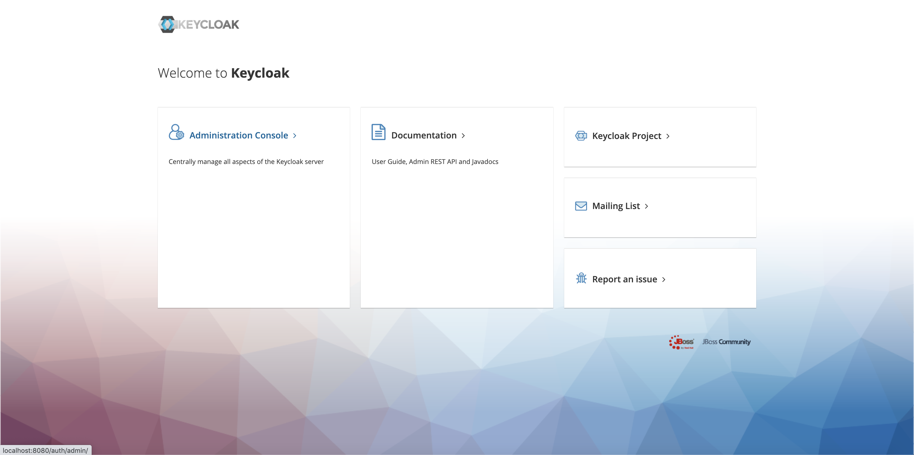

===============
AWSCLI SAML SSO
===============

.. image:: https://img.shields.io/pypi/v/awscli_saml_sso
        :target: https://pypi.org/pypi/awscli_saml_sso

.. image:: https://img.shields.io/pypi/l/awscli_saml_sso
        :target: https://pypi.org/pypi/awscli_saml_sso

.. image:: https://img.shields.io/pypi/pyversions/awscli_saml_sso
        :target: https://pypi.org/pypi/awscli_saml_sso

awscli_saml_sso is a command line tool that aims to get temporary credentials from SAML identity provider in order to authenticate to awscli.

.. _requirements:
Requirements
------------

* Python 3.5+
* Google Chrome, Chromium or Firefox web browser installed on operating system

.. _installation:
Installation
------------

You need a fully functional python 3 environment, then you can install tool from pypi:

.. code-block:: shell

    pip install awscli-saml-sso

.. _usage:
Usage
-----

You only need to run the following command in terminal:

.. code-block:: shell

    awscli_saml_sso

    # Please configure your identity provider url [https://<fqdn>:<port>/adfs/ls/IdpInitiatedSignOn.aspx?loginToRp=urn:amazon:webservices]:
    > ...

    # Please choose the role you would like to assume:
    # [ 0 ]:  arn:aws:iam::<account_number>:role/<role_name>
    # [ 1 ]:  arn:aws:iam::<account_number>:role/<role_name>
    # ...
    # Selection: <select among numbered roles>

    # ----------------------------------------------------------------
    # Your new access key pair has been stored in the AWS configuration file /home/.aws/credentials under the saml profile.
    # Note that it will expire at 2020-12-01 13:17:27+00:00.
    # After this time, you may safely rerun this script to refresh your access key pair.
    # To use this credential, call the AWS CLI with the --profile option (e.g. aws --profile saml ec2 describe-instances).
    # ----------------------------------------------------------------

    # Simple API example listing all S3 buckets:
    # ['your-lovely-bucket', ...]

1. ask you to fill in required identity provider url in the form of ``https://<fqdn>:<port>/adfs/ls/IdpInitiatedSignOn.aspx?loginToRp=urn:amazon:webservices``
2. open web browser to fulfil SSO authentication through your identity provider
3. retrieve attached AWS roles and ask you to choose role you would like to assume
4. provide a ``saml`` profile in ``/home/.aws/credentials`` filled with temporary credentials

At the end, you just need to use AWS cofigured ``saml`` profile to authenticate your ``awscli`` calls

.. code-block:: shell

    aws --profile saml ec2 describe-instances

OR

.. code-block:: shell

    AWS_PROFILE=saml aws ec2 describe-instances

.. _features:
Features
--------

* Authenticate through SAML identity provider in web browser
* Select among retrieved AWS roles you are allowed to assume
* Store temporary credentials in aws configuration files

.. _contributing:
Contributing
------------

Pull requests are welcome. For major changes, please open an issue first to discuss what you would like to change.
Please make sure to update tests as appropriate.
For further information, please read `CONTRIBUTING <CONTRIBUTING.rst>`_ document.

.. _development:
Development
-----------

If you would like to setup awscli-saml-sso for local development, please read the following section.
Before beginning, ensure to comply with requirements defined in :ref:`requirements` section.

You should create a python virtual environment:

.. code-block:: shell

    virtualenv -p python3 .venv
    # OR
    python3 -m venv .venv

    # THEN
    source .venv/bin/activate

You can figure out useful development requirements in `requirements_dev.txt <requirements_dev.txt>`_ and install them:

.. code-block:: shell

    pip install -r requirements_dev.txt

Then install a local editable version of awscli-saml-sso project with pip.
Under the hood, the following command will create an `awscli-saml-sso.egg-link <.venv/lib/python3.8/site-packages/awscli-saml-sso.egg-link>`_ file in ``.venv/lib/python3.8/site-packages/`` directory which contains a path pointing to your current awscli-saml-sso project directory.

.. code-block:: shell

    # from awscli-saml-sso project root
    pip install -e .

Thus you will be able to use development version of `awscli_saml_sso` cli.
Please check that this command correctly link to your local virtual environment:

.. code-block:: shell

    which awscli_saml_sso
    > /path/to/your/project/directory/.venv/bin/awscli_saml_sso

To ensure that `awscli_saml_sso` work properly, you will need:

* A configured SAML identity provider
* An access to AWS account

To prevent having to manually setup these requirements, you will find a ready to use local setup configured through `docker-compose.yml <docker-compose.yml>`_.
This configuration will setup the following environment:

* An instance of `localstack <https://github.com/localstack/localstack>`_ which aims to replicate AWS services locally
* A configured `keycloak <https://github.com/keycloak/keycloak>`_ server
* A postgresql instance as a database backend required for keycloak server

To setup this environment, just execute the following command:

.. code-block:: shell

    docker-compose up -d

After waiting few minutes, complete environment should be up and running.
You can run awscli-saml-sso this way to target localstack services endpoint instead of AWS default ones:

.. code-block:: shell

    awscli_saml_sso --endpoint-url=http://localhost:4566
    # OR
    ASS_ENDPOINT_URL=http://localhost:4566 awscli_saml_sso

You can now use the following url as your identity provider url when asked by awscli-saml-sso: http://localhost:8080/auth/realms/master/protocol/saml/clients/amazon-aws
If needed, you will find more details about the local environment setup in the following sections.

Localstack
^^^^^^^^^^

The provided `localstack <https://github.com/localstack/localstack>`_ instance setup a local server on port ``4566`` that can be used as an AWS backend for required services.
You can override the local exposed port by defining ``LOCALSTACK_EXPOSED_PORT`` environment variable.

You can interact with localstack this way, for instance to list existing buckets:

.. code-block:: shell

    AWS_ACCESS_KEY_ID='_not_needed_locally_' AWS_SECRET_ACCESS_KEY='_not_needed_locally_' aws --endpoint-url=http://localhost:4566 s3 ls

To ease local usage, you can leverage ``awslocal`` cli which is configured properly to rely on localstack backend:

.. code-block:: shell

    awslocal s3 ls

.. warning:: note the ``awslocal`` command will only target default ``4566`` port, please stick to first method if overriding exposed port

On container startup, localstack will automatically execute `localstack-setup.sh <./docker/localstack/localstack-setup.sh>`_ script which will provision default resources:

* An AWS S3 bucket named `example-bucket`
* An AWS SAML provider named `SamlExampleProvider`
* AWS roles named `Role.User` and `Role.Admin` which would be assumed by SSO users after authentication

Keycloak
^^^^^^^^

The provided `keycloak <https://github.com/keycloak/keycloak>`_ instance setup a local server on port ``8080`` that can be used as an identity provider backend.
You can override the local exposed port by defining ``KEYCLOAK_EXPOSED_PORT`` environment variable.

Keycloak expose a web interface that can be accessed at `http://localhost:8080 <http://localhost:8080>`_.

You can authenticate to `keycloak administration console <http://localhost:8080/auth/admin/>`_ with following credentials:

* username: admin
* password: admin

On container startup, keycloak will automatically import `master-realm-with-users.json <./docker/keycloak/master-realm-with-users.json>`_ configuration which will provision default resources:

* An ``urn:amazon:webservices`` `client <http://localhost:8080/auth/admin/master/console/#/realms/master/clients>`_ aims to register AWS as a SAML service provider
* Role mapping has been properly defined with default provided `users <http://localhost:8080/auth/admin/master/console/#/realms/master/users>`_ and `groups <http://localhost:8080/auth/admin/master/console/#/realms/master/groups>`_.

Following users has been defined:

* AWS ADMIN
  * username: aws_admin
  * password: aws_admin
  * groups: AWS_ADMINS, AWS_USERS
* AWS USER
  * username: aws_user
  * password: aws_user
  * groups: AWS_USERS
* AWS VOID
  * username: aws_void
  * password: aws_void
  * groups: N/A (not attached to any group)

Thus you can now use the following url as your identity provider url when asked by awscli-saml-sso: http://localhost:8080/auth/realms/master/protocol/saml/clients/amazon-aws

Please feel free to update keycloak configuration from administration console to fulfil your needs.
If you think that your configuration should be setup by default, you can export it this way, replace `master-realm-with-users.json <./docker/keycloak/master-realm-with-users.json>`_ content then submit your pull request :)

.. code-block:: shell

    docker-compose run --rm -v $(pwd)/export:/tmp/export keycloak -Djboss.socket.binding.port-offset=100 -Dkeycloak.migration.action=export -Dkeycloak.migration.provider=singleFile -Dkeycloak.migration.file=/tmp/export/master-realm-with-users.json

    > [...]
    > 13:21:15,119 INFO  [org.keycloak.services] (ServerService Thread Pool -- 67) KC-SERVICES0033: Full model export requested
    > 13:21:15,925 INFO  [org.keycloak.services] (ServerService Thread Pool -- 67) KC-SERVICES0035: Export finished successfully
    > 13:21:15,119 INFO  [org.keycloak.exportimport.singlefile.SingleFileExportProvider] (ServerService Thread Pool -- 67) Exporting model into file /tmp/export/master-realm-with-users.json
    > [...]

When you read above logs, you can hit ``CTRL+C`` to stop running instance.
You will find a ``master-realm-with-users.json`` file in ``export`` directory created in your current path.

.. _credits:
Credits
-------

`AWS - How to Implement Federated API and CLI Access Using SAML 2.0 and AD FS <https://aws.amazon.com/blogs/security/how-to-implement-federated-api-and-cli-access-using-saml-2-0-and-ad-fs>`_
`AWS SAML based User Federation using Keycloak <https://neuw.medium.com/aws-connect-saml-based-identity-provider-using-keycloak-9b3e6d0111e6>`_

.. _license:
License
-------

``awscli_saml_sso`` is open source software released under the `GNU GPLv3 <https://choosealicense.com/licenses/gpl-3.0>`_.
